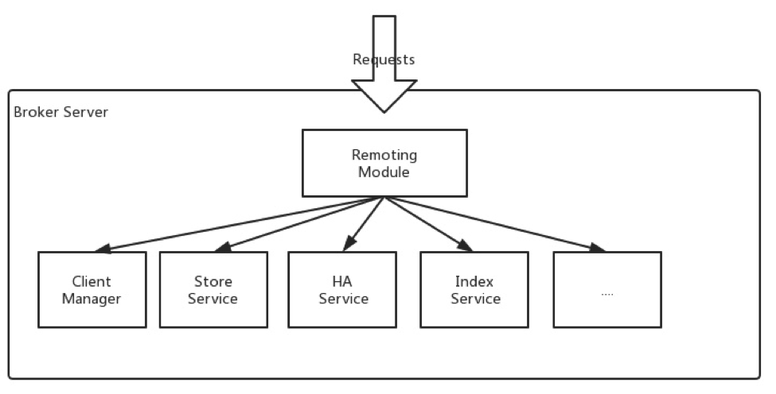

###然

nameserver:存储broker的完整路由信息，用于实现服务发现。并支持了这些数据的读写和快速扩展（能够集群化）

broker:存放消息的实际几点，支持push和pull模式。拥有容错机制（2-3备份？？），峰值填充能力，按时间顺序积累大量（上亿数据）消息，灾难恢复，丰富的度量统计，报警机制。

consumer:消息消费者，支持集群，广播，实时消息订阅机制

producer:消息提供者，可以集群化，负载均衡向broker集群发送消息，发送进程能够快速失败（？），延迟低

###所以然

<b>自解<b/>监听回调机制，解耦。

	场景 ： 一种异步的实现方案：请求集体到达，过滤请求后，将不满足的请求直接拒绝，满足的请求放入队列，后端按照自己的最大能力处理问题，然后返回给消息队列，然后返回给前端。

	1  实现异步处理，消息队列缓存请求，大量的请求处理不会占用服务器资源，造成后端业务阻塞。
	2 解耦，消息队列隔开了请求合法性校验和实际业务逻辑
	3 流量控制，大量的请求进入了消息队列，不会直接冲入后端业务服务器
	4 常见的mq支持广播
	5 分开部署，避免但节点问题。
	
####nameserver

	两个future
	路由管理：整个broker的路由信息和客户端的查询队列
	broker管理：broker注册，心跳
	有四种方法可以配置nameserver的地址到客户端：

	Programmatic Way, like producer.setNamesrvAddr("ip:port").  代码级别  最高优先级
	Java Options, use rocketmq.namesrv.addr.	jvm参数 次优先级
	Environment Variable, use NAMESRV_ADDR.		系统环境 再次优先级
	HTTP Endpoint.								http 最低优先级（被推荐使用这种方式，配置灵活，无需重启）

####broker

	Remoting module ：处理来自客户端的请求
	Client manger : 管理所有客户端（consumer，producer） 同时维护客户端的监听主题
	store service ： 提供接口在物理磁盘上存储或者查询消息
	HA module ： 用于主从同步
	Index Service ： 为消息构建特殊的key，提供快速查询 

###Group

	具有相同role的实例，放在一起作为一个组。

####producer

	producer和broker之间支持三种方式传递message
	同步
	异步
	单向

？？

	Considering the provided producer is sufficiently powerful at sending messages, only one instance is allowed per producer group to avoid unnecessary initialization of producer instances.
	
####consumer
	pull模式：直接到broker拉去message，然后丢到消费任务中消费
	push模式：框架实现了message的传递，给用户留下了回调接口，用户实现如何消费message

	consumer instances of a consumer group must have exactly the same topic subscription(s)

